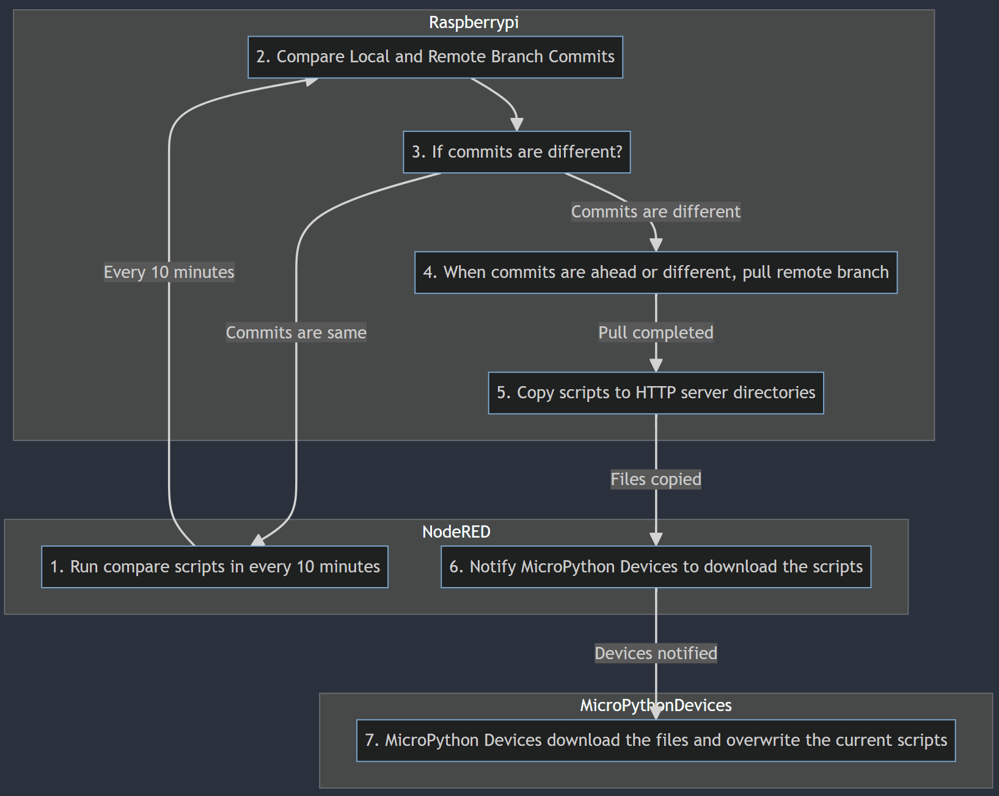

# epd-aquams-electronics

## Setup On-The-Air Update for Micropython ESP32
On The Air Update for Micropython ESP32 using Github repository on Raspberrypi http server.

## Prerequisites
- Must have a github account
- Have created github [personal access token](https://docs.github.com/en/authentication/keeping-your-account-and-data-secure/managing-your-personal-access-tokens#creating-a-personal-access-token-classic)

### Create a config.json file
1. Follow the config-sample.json
2. Replace the details with your details
3. create a folder /home/pi/file_server/ESP32

### Setup Python Virtual Environment
```bash
# Create a pip virtual environment
python -m venv venv

# Activate the virtual environment
source /venv/bin/activate

# Install required libaries
pip install -r requirements.txt
```
### Run on node-red for every 10 minutes
```bash
# 1. Add inject node interval 10 minutes

# 2. Add this command into a script node
cd development/epd-aquams-electronics/ && bash run.sh
```

## Setup MicroPython for ESP32 or ESP8266
## Prerequisites
- For Windows must install CP210x USB to UART Bridge

## flash the micropython
1. Download the latest Micropython Firmware: https://micropython.org/download/esp32/
2. For easy flash install Thonny IDE.
3. Open Thonny IDE Tools > Interpreter.
4. Choose the MicroPython ESP32 as interpreter.
5. Choose port that your ESP32 connected to.
6. Click Install or update firmware at the bottom right.
7. Choose port that your ESP32 connected to.
8. Browse the firmware that you download.
9. Click install. if its error, check your thonny IDE if its access sudo/administrator privilege.

## Testing the MicroPython

1. Open Thonny IDE make sure the intrepreter is Micropython ESP32.
2. Create new file named main.py and write a simple python print hello world code.
3. Save it choose on MicroPython Device.
4. And run the script on Thonny IDE. We will see the hello world is displayed on terminal thats mean the MicroPython is successfully installed.


## MQTT
### Installing MQTT Client
- We were follow this tutorials for installing MQTT client: https://randomnerdtutorials.com/micropython-mqtt-esp32-esp8266/


## Humidity and Temperature sensors DHT11
1. reference here: https://randomnerdtutorials.com/esp32-esp8266-dht11-dht22-micropython-temperature-humidity-sensor/

### Static IP address
- IP address has set to static to prevent IP address from conflict between ESP32.
1. CO = 192.168.0.120
2. DHT22 = 192.168.0.121
3. NO2 = 192.168.0.122
4. SO2 = 192.168.0.123
5. PM2.5 = 192.168.0.124
6. O3 = 192.168.0.125


### Sensors Unit Types

|   | gasType  | Unit  | Concentration | Voltage | Temperature | Range  |
|---|----------|-------|---------------|---------|-------------|--------|
|   | CO       | ppm   | float         | float   | float       | 0-1000 |
|   | SO2      | ppm   | float         | float   | float       | 0-20   |
|   | NO2      | ppm   | float         | float   | float       | 0-20   |
|   | O3       | ppm   | float         | float   | float       | 0-10   |
|   | Temp_C   | ℃     | float         | float   | float       | -40-80 |
|   | Temp_F   | ℉     | float         | float   | float       | 40-176 |
|   | Humidity | %RH   | float         | float   | float       | 0-100  |
|   | PM2.5    | µg/m³ | float         | -       | -           | 0-1000 |
|   | PM10     | µg/m³ | float         | -       | -           | 0-1000 |


The Architectures:

[](assets/images/steps-process.png "Micropython OTA Architecture" )